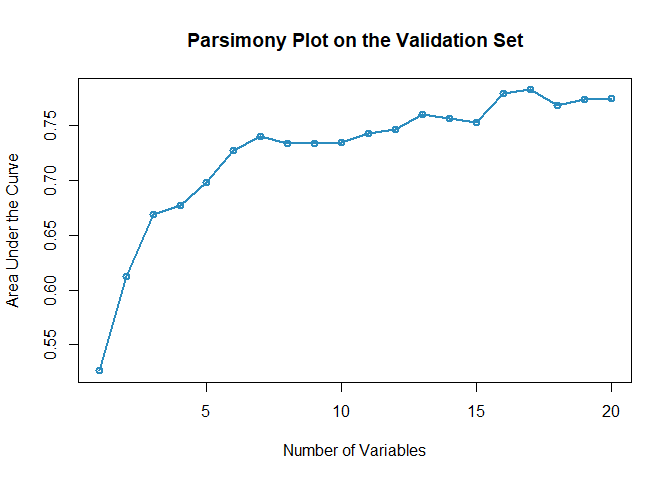

AutoScore-Survival: Developing interpretable machine learning-based
time-to-event scores with right-censored survival data
================

  - [**AutoScore-Survival
    Introduction**](#autoscore-survival-introduction)
      - [Description](#description)
      - [Functions and pipeline](#functions-and-pipeline)
      - [Citation](#Citation)
      - [Contact](#Contact)
  - [**AutoScore-Survival
    Demonstration**](#autoscore-survival-demonstration)
      - [Load R package](#load-r-package)
      - [Load data](#load-data)
      - [Data preprocessing (Users to check the
        following)](#data-preprocessing-users-to-check-the-following)
      - [AutoScore-Survival preprocessing (Users to check the
        following)](#autoscore-survival-preprocessing-users-to-check-the-following)
      - [**AutoScore-Survival Demo **](#autoscore-survival-demo-)
          - [Prepare training, validation, and test
            datasets](#prepare-training-validation-and-test-datasets)
          - [STEP(i): Generate variable ranking list (AutoScore-Survival
            Module
            1)](#stepi-generate-variable-ranking-list-autoscore-survival-module-1)
          - [STEP(ii): Select the best model with parsimony plot
            (AutoScore-Survival Modules
            2+3+4)](#stepii-select-the-best-model-with-parsimony-plot-autoscore-survival-modules-234)
          - [STEP(iii): Generate initial scores with the final list of
            variables (Re-run AutoScore-Survival Modules
            2+3)](#stepiii-generate-initial-scores-with-the-final-list-of-variables-re-run-autoscore-survival-modules-23)
          - [STEP(iv): Fine-tune the initial score generated in
            STEP(iii) (AutoScore-Survival Module 5 & Re-run
            AutoScore-Survival Modules
            2+3)](#stepiv-fine-tune-the-initial-score-generated-in-stepiii-autoscore-survival-module-5--re-run-autoscore-survival-modules-23)
          - [STEP(v): Evaluate final risk scores on test dataset
            (AutoScore-Survival Module
            6)](#stepv-evaluate-final-risk-scores-on-test-dataset-autoscore-survival-module-6)

# **AutoScore-Survival Introduction**

  - **AutoScore-Survival**

### Description

AutoScore-Survival is a novel machine learning framework to automate the
development of interpretable time-to-event scores. AutoScore-Survival
consists of six modules: 1) variable ranking with machine learning, 2)
variable transformation, 3) score derivation, 4) model selection, 5)
domain knowledge-based score fine-tuning, and 6) performance evaluation.
The AutoScore-Survival is elaborated in the article
(<http://dx.doi.org/10.2196/21798> and
<https://arxiv.org/abs/2106.06957>). AutoScore-Survival could seamlessly
generate risk scores based on survival data, which can be easily
implemented and validated in clinical practice. Moreover, it enables
users to build transparent and interpretable time-to-event scores
quickly in a straightforward manner.

### Functions and pipeline

The five pipeline functions: `AutoScore_Survival_rank()`,
`AutoScore_Survival_parsimony()`, `AutoScore_Survival_weighting()`,
`AutoScore_Survival_fine_tuning()` and `AutoScore_Survival_testing()`
constitute the 5-step AutoScore-based process for generating point-based
clinical scores. This 5-step process gives users the flexibility of
customization (e.g., determining the final list of variables according
to the parsimony plot, and fine-tuning the cutoffs in variable
transformation). Please follow the step-by-step instructions (in Demos)
to build your own scores.

  - STEP(i): `AutoScore_Survival_rank()` - Rank variables with Random
    Survival Forest (AutoScore-Survival Module 1)
  - STEP(ii): `AutoScore_Survival_parsimony()` - Select the best model
    with parsimony plot (iAUC) (AutoScore-Survival Modules 2+3+4)
  - STEP(iii): `AutoScore_Survival_weighting()` - Generate the initial
    score with the final list of variables (Re-run AutoScore-Survival
    Modules 2+3)
  - STEP(iv): `AutoScore_Survival_fine_tuning()` - Fine-tune the score
    by revising `cut_vec` with domain knowledge (AutoScore-Survival
    Module 5)
  - STEP(v): `AutoScore_Survival_testing()` - Evaluate the final score
    with ROC(t) analysis (AutoScore-Survival Module 6)

Note: This is just the initial version of the AutoScore-Survival.
Further version will be developed and updated.

### Citation

Xie F, Ning Y, Yuan H, Goldstein BA, Ong MEH, Liu N, Chakraborty B. 
AutoScore-Survival: Developing interpretable machine learning-based time-to-event scores with right-censored survival data
Journal of biomedical informatics, 125 (2022) (<https://doi.org/10.1016/j.jbi.2021.103959>)

Xie F, Chakraborty B, Ong MEH, Goldstein BA, Liu N. AutoScore: A Machine
Learning-Based Automatic Clinical Score Generator and Its Application to
Mortality Prediction Using Electronic Health Records. JMIR Medical
Informatics 2020;8(10):e21798 (<http://dx.doi.org/10.2196/21798>)

### Contact

  - Feng Xie (Email: <xief@u.duke.nus.edu>)
  - Nan Liu (Email: <liu.nan@duke-nus.edu.sg>)

# **AutoScore-Survival Demonstration**

### Load R package

``` r
library(survival)
library(randomForestSRC)
library(survAUC)
library(knitr)
source('D:/Document/AutoScore-Survival/R/AutoScore_Survival.R')
load("D:/Document/sample_data_survival.RData")
```

### Load data

  - Read data from CSV or Excel files.
  - `sample_data_survival` has 10000 samples, with the same
    distribution as the data in the MIMIC-III ICU database
    (<https://mimic.mit.edu/>).

<!-- end list -->

``` r
head(sample_data_survival)
#>            Age GENDER ETHNICITY INSURANCE heartrate_mean sysbp_mean diasbp_mean
#> 13515 59.39907      F    Others   Private       83.77419   106.6364    43.12121
#> 18738 46.66896      M     WHITE  Medicaid       66.44000   124.5217    76.13043
#> 3413  81.67858      M     WHITE  Medicare       89.61111   121.9394    63.18182
#> 36336 68.24655      M     WHITE  Medicare       97.11111   142.6429    64.78571
#> 16682 39.93715      F    Others  Medicaid      114.03226   138.4348    86.34783
#> 57488 75.56852      M     WHITE  Medicare       84.23077   108.6250    61.04167
#>       meanbp_mean resprate_mean tempc_mean spo2_mean glucose_mean aniongap_mean
#> 13515    67.19192      17.89189   36.84286  99.33333     137.7692          11.0
#> 18738    88.17391      14.96000   36.27778  97.12000      96.0000          12.5
#> 3413     81.90909      17.29545   36.73810  97.62857     226.4444          13.0
#> 36336    89.70238      18.14815   37.04365  96.55556     160.5714          23.0
#> 16682    98.18182      25.55556   37.45555  98.53125      76.0000          12.0
#> 57488    72.12500      22.30769   37.42857  97.73077     138.7500          11.5
#>       bicarbonate_mean creatinine_mean chloride_mean lactate_mean
#> 13515             27.0            0.40         102.0          1.8
#> 18738             26.5            1.00         107.0          1.8
#> 3413              25.0            1.10         116.0          2.4
#> 36336             20.5           10.40          95.5          2.1
#> 16682             26.0            1.10         107.0          3.6
#> 57488             23.5            0.55         101.0          1.8
#>       hemoglobin_mean hematocrit_mean platelet_mean potassium_mean bun_mean
#> 13515           10.60           32.00         179.0           4.45      9.0
#> 18738           13.05           38.35         300.0           4.45     22.5
#> 3413            12.20           35.00         110.0           3.90     17.0
#> 36336            7.80           24.35         174.0           4.40    106.5
#> 16682           12.70           37.55         276.0           4.15     10.5
#> 57488            9.55           28.25         404.5           3.80      9.5
#>       sodium_mean wbc_mean time status
#> 13515       136.5    15.10   91      0
#> 18738       141.5     4.95   91      0
#> 3413        150.0    10.40    6      1
#> 36336       134.5    15.70   73      1
#> 16682       140.5     8.00   91      0
#> 57488       132.0    12.20   23      1
```

### Data preprocessing (Users to check the following)

  - Handle missing values (AutoScore-Survival requires a complete
    dataset).
  - Remove special characters from variable names, e.g., `[`, `]`, `(`,
    `)`,`,`. (Suggest using `_` to replace them if needed)
  - Name of the variable should be unique and not entirely included by
    other variable names.
  - Ensure that there are dependent variables (“time” and “status”)
  - Independent variables should be numeric (class: num/int) or
    categorical (class: factor/logic).
  - Handle outliers (optional).
  - Check variable distribution (optional).

### AutoScore-Survival preprocessing (Users to check the following)

  - Check if data fulfill the basic requirement by AutoScore-Survival.
  - Fix the problem if you see any warnings.

<!-- end list -->

``` r
check_data(sample_data_survival)
#> 
#>  missing value check passed.
```

  - Modify your data, and run the `check_data` again until there are no
    warning messages.

<h id="Demo1">

## **AutoScore-Survival Demo **

In Demo \#1, we demonstrate the use of AutoScore-Survival on a
comparably large dataset where separate training and validation sets are
available. Please note that it is just a demo using simulated data, and
thus, the result might not be clinically meaningful.

### Prepare training, validation, and test datasets

  - Option 1: Prepare three separate datasets to train, validate, and
    test models.
  - Option 2: Use demo codes below to randomly split your dataset into
    training, validation, and test datasets (70%, 10%, 20%,
    respectively).

<!-- end list -->

``` r
set.seed(4)
out_split <- split_data(data = sample_data_survival, ratio = c(0.7, 0.1, 0.2))
train_set <- out_split$train_set
validation_set <- out_split$validation_set
test_set <- out_split$test_set
```

### STEP(i): Generate variable ranking list (AutoScore-Survival Module 1)

  - `ntree`: Number of trees in the random forest algorithm (Default:
    100).

<!-- end list -->

``` r
ranking <- AutoScore_Survival_rank(train_set, ntree = 100)
```

### STEP(ii): Select the best model with parsimony plot (AutoScore-Survival Modules 2+3+4)

  - `nmin`: Minimum number of selected variables (Default: 1).
  - `nmax`: Maximum number of selected variables (Default: 20).
  - `categorize`: Methods for categorizing continuous variables. Options
    include `"quantile"` or `"kmeans"` (Default: `"quantile"`).
  - `quantiles`: Predefined quantiles to convert continuous variables to
    categorical ones. (Default: `c(0, 0.05, 0.2, 0.8, 0.95, 1)`)
    Available if `categorize = "quantile"`.
  - `max_cluster`: The max number of cluster (Default: 5). Available if
    `categorize = "kmeans"`.
  - `max_score`: Maximum total score (Default: 100).

<!-- end list -->

``` r
AUC <- AutoScore_Survival_parsimony(
    train_set,
    validation_set,
    rank = ranking,
    max_score = 100,
    n_min = 1,
    n_max = 20,
    categorize = "quantile",
    quantiles = c(0, 0.05, 0.2, 0.8, 0.95, 1)
    
  )
#> Select 1 Variable(s):  0.5264094
#> Select 2 Variable(s):  0.6125118
#> Select 3 Variable(s):  0.6685712
#> Select 4 Variable(s):  0.6771743
#> Select 5 Variable(s):  0.6977727
#> Select 6 Variable(s):  0.7275343
#> Select 7 Variable(s):  0.7397659
#> Select 8 Variable(s):  0.7334412
#> Select 9 Variable(s):  0.7332976
#> Select 10 Variable(s):  0.7341622
#> Select 11 Variable(s):  0.7431479
#> Select 12 Variable(s):  0.7463571
#> Select 13 Variable(s):  0.759708
#> Select 14 Variable(s):  0.7563187
#> Select 15 Variable(s):  0.7530841
#> Select 16 Variable(s):  0.7788929
#> Select 17 Variable(s):  0.782435
#> Select 18 Variable(s):  0.7678376
#> Select 19 Variable(s):  0.7741454
#> Select 20 Variable(s):  0.7750084
```

<!-- -->

  - Users could use the `AUC` for further analysis or export it as the
    CSV to other software for plotting.

<!-- end list -->

``` r
write.csv(data.frame(AUC), file = "D:/AUC.csv")
```

  - Determine the optimal number of variables (`num_var`) based on the
    parsimony plot obtained in STEP(ii).
  - The final list of variables is the first `num_var` variables in the
    ranked list `ranking` obtained in STEP(i).
  - Optional: User can adjust the finally included variables
    `final_variables` based on the clinical preferences and knowledge.

<!-- end list -->

``` r
# Example 1: Top 6 variables are selected
num_var <- 6
final_variables <- names(ranking[1:num_var])

# Example 2: Top 9 variables are selected
num_var <- 9
final_variables <- names(ranking[1:num_var])

# Example 3: Top 6 variables, the 9th and 10th variable are selected
num_var <- 6
final_variables <- names(ranking[c(1:num_var, 9, 10)])
```

### STEP(iii): Generate initial scores with the final list of variables (Re-run AutoScore-Survival Modules 2+3)

  - Generate `cut_vec` with current cutoffs of continuous variables,
    which can be fine-tuned in STEP(iv).
  - `time_point`: The time points to be evaluated using time-dependent
    AUC(t).

<!-- end list -->

``` r
cut_vec <- AutoScore_Survival_weighting( 
    train_set,
    validation_set,
    final_variables,
    max_score = 100,
    categorize = "quantile",
    quantiles = c(0, 0.05, 0.2, 0.8, 0.95, 1),
    time_point = c(1,3,7,14,30,60,90)
  )
#> ****Included Variables: 
#>     variable_name
#> 1             Age
#> 2        bun_mean
#> 3   resprate_mean
#> 4 creatinine_mean
#> 5   aniongap_mean
#> 6    lactate_mean
#> ****Initial Scores: 
#> 
#> 
#> ===============  ===========  =====
#> variable         interval     point
#> ===============  ===========  =====
#> Age              <30            0  
#>                  [30,48.8)     11  
#>                  [48.8,77.9)   15  
#>                  [77.9,85.2)   22  
#>                  >=85.2        24  
#>                                    
#> bun_mean         <7.5           0  
#>                  [7.5,11.5)     4  
#>                  [11.5,34)     10  
#>                  [34,66)       21  
#>                  >=66          25  
#>                                    
#> resprate_mean    <13.3          4  
#>                  [13.3,15.4)    0  
#>                  [15.4,21.3)    3  
#>                  [21.3,25.6)    8  
#>                  >=25.6        12  
#>                                    
#> creatinine_mean  <0.5          17  
#>                  [0.5,0.7)      7  
#>                  [0.7,1.6)      2  
#>                  [1.6,4.4)      4  
#>                  >=4.4          0  
#>                                    
#> aniongap_mean    <9.5           0  
#>                  [9.5,11.5)     2  
#>                  [11.5,16.5)    3  
#>                  [16.5,20.5)    4  
#>                  >=20.5         8  
#>                                    
#> lactate_mean     <1             0  
#>                  [1,1.5)        0  
#>                  [1.5,2.3)      0  
#>                  [2.3,4.3)      4  
#>                  >=4.3         15  
#> ===============  ===========  =====
#> Integrated AUC by all time points: 0.7275343
#> C_index:  0.711777 
#> The AUC(t) are shown as bwlow:
#>   time_point     AUC_t
#> 1          1 0.7629788
#> 2          3 0.7032028
#> 3          7 0.7277124
#> 4         14 0.7207447
#> 5         30 0.7240616
#> 6         60 0.7413147
#> 7         90 0.7299956
#> ***The cutoffs of each variable generated by the AutoScore are saved in cut_vec. You can decide whether to revise or fine-tune them
```

### STEP(iv): Fine-tune the initial score generated in STEP(iii) (AutoScore-Survival Module 5 & Re-run AutoScore-Survival Modules 2+3)

  - Revise `cut_vec` with domain knowledge to update the scoring table
    (AutoScore-Survival Module 5).
  - Re-run AutoScore-Survival Modules 2+3 to generate the updated
    scores.
  - Users can choose any cutoff values and/or any number of categories,
    but are suggested to choose numbers close to the automatically
    determined values.

<!-- end list -->

``` r
## For example, we have current cutoffs of continuous variable: Age 
## ===============  ===========  =====
## variable         interval     point
## ===============  ===========  =====
## Age              <31.3          0  
##                  [31.3,49.1)   12  
##                  [49.1,78.2)   17  
##                  [78.2,85.2)   22  
##                  >=85.2        25 
```

  - Current cutoffs:`c(31.3, 49.1, 78.2, 85.2)`. We can fine tune the
    cutoffs as follows:

<!-- end list -->

``` r

# Example 1: rounding up to a nice number
cut_vec$Age <- c(35, 50, 75, 85)

# Example 2: changing cutoffs according to clinical knowledge or preference 
cut_vec$Age <- c(25, 50, 75, 85)

# Example 3: combining categories
cut_vec$Age <- c(50, 75, 85)
```

  - Then we do similar checks for other variables and update scoring
    table using new cutoffs if needed.
  - `time_point`: The time points to be evaluated using time-dependent
    AUC(t).

<!-- end list -->

``` r
cut_vec$lactate_mean <- c(0.2, 1, 3, 4)
cut_vec$bun_mean <- c(10, 40)
cut_vec$aniongap_mean <- c(10, 17)
scoring_table <- AutoScore_Survival_fine_tuning(train_set,
                        validation_set,
                        final_variables,
                        cut_vec,
                        max_score = 100,
                        time_point = c(1,3,7,14,30,60,90))
#> ***Fine-tuned Scores: 
#> 
#> 
#> ===============  ===========  =====
#> variable         interval     point
#> ===============  ===========  =====
#> Age              <50            0  
#>                  [50,75)        7  
#>                  [75,85)       16  
#>                  >=85          19  
#>                                    
#> bun_mean         <10            0  
#>                  [10,40)       12  
#>                  >=40          25  
#>                                    
#> resprate_mean    <13.3          6  
#>                  [13.3,15.4)    0  
#>                  [15.4,21.3)    4  
#>                  [21.3,25.6)   10  
#>                  >=25.6        15  
#>                                    
#> creatinine_mean  <0.5          17  
#>                  [0.5,0.7)      5  
#>                  [0.7,1.6)      0  
#>                  [1.6,4.4)      5  
#>                  >=4.4          1  
#>                                    
#> aniongap_mean    <10            0  
#>                  [10,17)        2  
#>                  >=17           5  
#>                                    
#> lactate_mean     <1             0  
#>                  [1,3)          1  
#>                  [3,4)          6  
#>                  >=4           19  
#> ===============  ===========  =====
#> ***Performance (based on validation set, after fine-tuning):
#> Integrated AUC by all time points: 0.6996139
#> C_index:  0.6830529 
#> The AUC(t) are shown as bwlow:
#>   time_point     AUC_t
#> 1          1 0.7675151
#> 2          3 0.6779422
#> 3          7 0.7028370
#> 4         14 0.6927692
#> 5         30 0.6850160
#> 6         60 0.7051068
#> 7         90 0.6991369
```

### STEP(v): Evaluate final risk scores on test dataset (AutoScore-Survival Module 6)

  - `time_point`: The time points to be evaluated using time-dependent
    AUC(t).
  - `with_label`: Set to `TRUE` if there are labels in the `test_set`
    and performance will be evaluated accordingly (Default: `TRUE`).
  - Set the `with_label` to `FALSE` if there are not `label` in the
    `test_set` and the final predicted scores will be the output without
    performance evaluation.

<!-- end list -->

``` r
pred_score <- AutoScore_Survival_testing(test_set, final_variables, cut_vec, scoring_table, threshold = "best", with_label = TRUE, time_point = c(1,3,7,14,30,60,90))
#> ***Performance using AutoScore (based on unseen test Set):
#> Integrated AUC by all time points: 0.7325347
#> C_index:  0.7046158 
#> The AUC(t) are shown as bwlow:
#>   time_point     AUC_t
#> 1          1 0.7359898
#> 2          3 0.7597619
#> 3          7 0.7432432
#> 4         14 0.7248715
#> 5         30 0.7167943
#> 6         60 0.7316393
#> 7         90 0.7208223
head(pred_score)
#>   pred_score time status
#> 1         33   91      0
#> 2         38   91      0
#> 3         26   91      0
#> 4         35   91      0
#> 5         49   14      1
#> 6         26   91      0
```

  - Users could use the `pred_score` for further analysis or export it
    as the CSV to other software.

<!-- end list -->

``` r
write.csv(pred_score, file = "D:/pred_score.csv")
```
